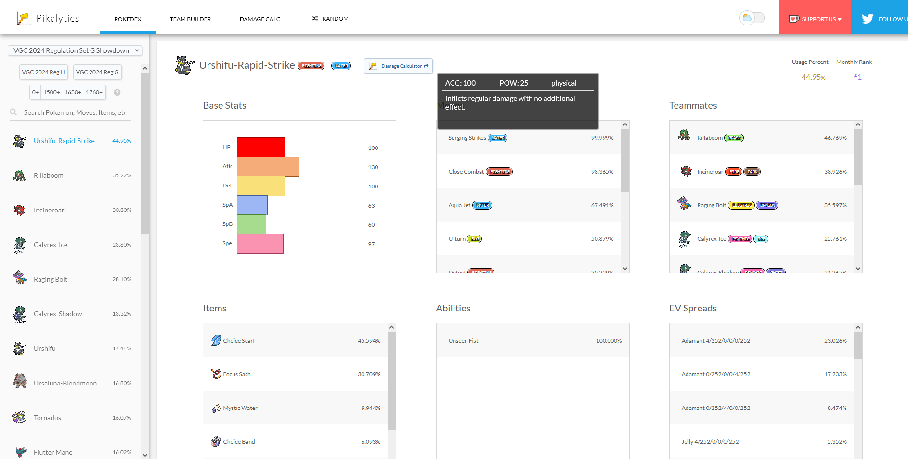
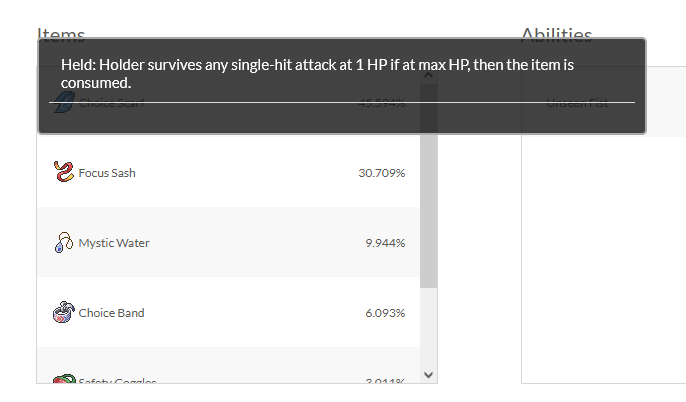
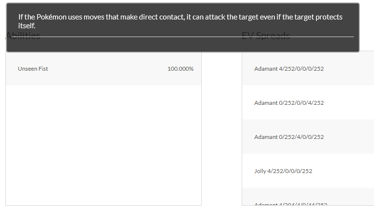

# Pikalytics Overlay
Simple User Script which adds an overlay on mouse hover to various elements on https://pikalytics.com/

## Installation
To use this Script, you need [Tampermonkey](https://www.tampermonkey.net/). Other user script managers might workt as well, but I have not tested any other.

Afte you have installed Tampermonkey, [click here](pikalytics.user.js?raw=1) to add the script to your browser.

## Images
### Move Overlay

### Item Overlay

### Ability Overlay

## Credits
This project makes use of several valuable resources:

- [PokeAPI Project](https://pokeapi.co/): All information is accessed through this API.
- [PokeAPI JS Wrapper](https://github.com/PokeAPI/pokeapi-js-wrapper): The JavaScript wrapper for the PokeAPI. 
- [jQuery](https://jquery.com/): The script uses jQuery for simplifying DOM manipulation and event handling. 

**Thank you for your awesome work!**

Pokémon and Pokémon character names are trademarks of Nintendo. The author of this GitHub repository is not connected to Nintendo in any way, nor is he connected to Pikalytics.com.